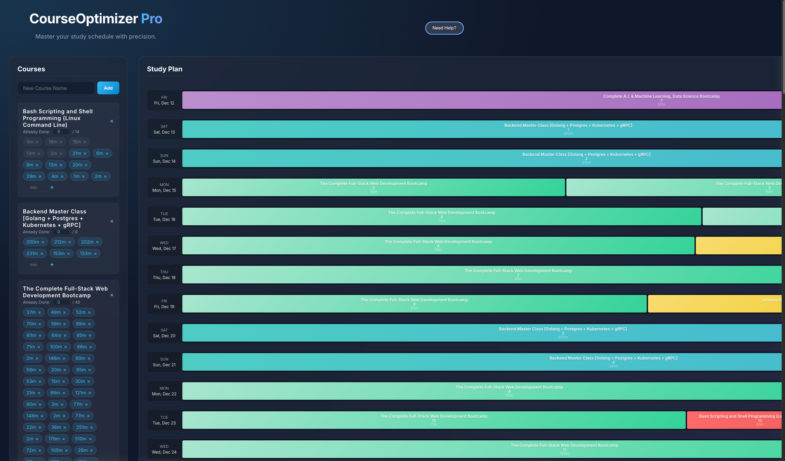

# Course Optimizer

Course Optimizer is a powerful, intelligent scheduling tool designed to transform a list of educational courses and massive video lectures into a pragmatic, manageable daily study plan.

It uses an advanced scheduling algorithm to break down "giant" sections, fill available time slots aggressively, and ensure continuity, producing a Gantt-style study roadmap. The ultimate goal is to generate a plan that you can **export to Excel**, where it becomes a living "Gantt Tracker" with progress percentages and interactive checkboxes.



## 🚀 Features

-   **Intelligent Scheduling Algorithm**:
    -   **Giant Section Handling**: Automatically splits massive courses that exceed daily limits into manageable "Part 1, Part 2..." chunks.
    -   **Aggressive Filling**: Ensures no day is largely wasted; if a small slot is open, it fills it with a suitable section.
    -   **Fresh Start Logic**: Prevents large "Giant" tasks from starting on cluttered days to maintain mental focus.
-   **Dynamic Dashboard**:
    -   Interactive Gantt chart visualization.
    -   Timeline blocks with gradient styling.
-   **Advanced Excel Export**:
    -   Generates a professional `.xlsx` file.
    -   **Interactive Checkboxes**: Dropdown cells to mark days as done.
    -   **Auto-Computing Progress**: "PCT Complete" column updates in real-time as you check off boxes.
    -   **Two-Level Tracking**: Track progress at the Section level and the aggregate Course level.
-   **Data Persistence**: Automatically saves your work to local storage so you never lose your configuration.
-   **Import/Export JSON**: Share or backup your configuration easily.

## 🛠️ Tech Stack

-   **Frontend**: React (Vite)
-   **Styling**: CSS Modules / Modern CSS Variables (Dark/Light mode ready)
-   **Data Processing**: Custom Scheduling Heuristics (JavaScript)
-   **Export**: `exceljs` for advanced spreadsheet generation

## 📦 Installation

1.  Clone the repository:
    ```bash
    git clone https://github.com/yourusername/course-optimizer.git
    cd course-optimizer
    ```
2.  Install dependencies:
    ```bash
    npm install
    ```
3.  Start the development server:
    ```bash
    npm run dev
    ```

## 📖 Usage Workflow

1.  **Add Courses**: Enter your course names and the total duration (in minutes) for each section.
2.  **Define Limits**: In the "Schedule Config" panel, set your maximum study minutes for each day of the week (e.g., Mon: 120m, Sat: 300m).
3.  **Generate**: The system automatically calculates the optimal start/end dates and distributes the load.
4.  **Export**: Click **"Export Excel Gantt"**.
5.  **Track**: Open the Excel file. As you complete daily study blocks, select the **"✓"** from the dropdown in the timeline cells. Watch the `% Complete` column rise!

## 🤝 Contributing

Contributions are welcome! Please feel free to submit a Pull Request.

## 📄 License

This project is open source and available under the [MIT License](LICENSE).
